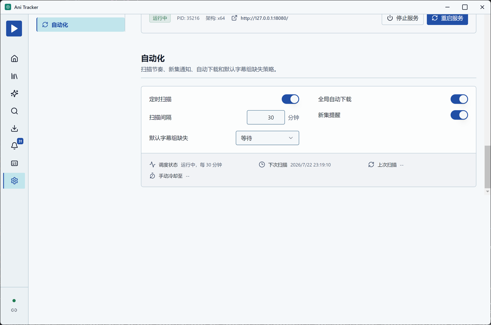
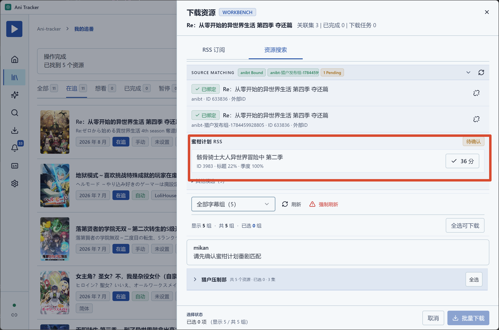

增加一些日志打印出扫描时候对应的番剧名称和评分、字幕组来源等。

在设置 【默认字幕组缺失】时，选择候补字幕组， 增加一个下拉多选框,用户可以多选候补字幕组。以便降低自动化下载难度。字幕组的数据来源用户可以自己输入加入多选框中。也可以删除。UI设计这样，一个输入框，操作流程：用户输入文件时，输入框的右侧出现加号。已选择的字幕组在下拉的时候右边出现-号，方便新增删除。字幕组的匹配规则为：字母则忽略大小写。中文等则全量匹配。

  设置点击自动化栏目后跳转后，会这样子。
 如果来源匹配人工没有选上，则可以确认不匹配。需要增加一个类似不匹配的按钮